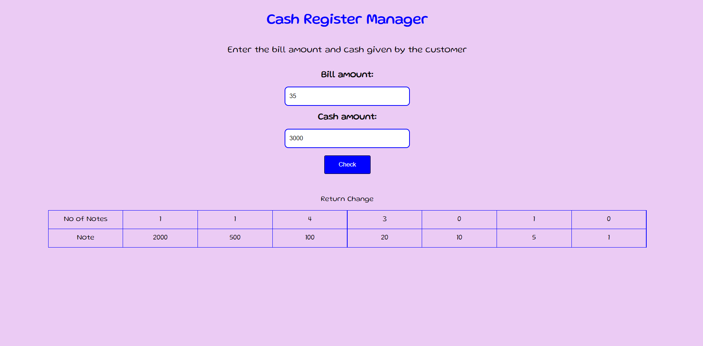

# **Cash Register App**
This is a app that tells the user how many notes are required to return the change by giving the bill amount and cash given amount as the input.
This app considers the denomination of notes to be 1000, 500, 100, 20, 10 ,5 ,1.

---

## **Interface of the app**

---
## **How to use the app**

1. Asks the user to enter the Bill amount.
2. Then, asks the user to enter cash amount.
3. Click on Check button.
4. Then displays the number of notes required to return the change.

---
## **Tech Stack used.**

1. HTML
2. CSS
3. JavaScript

## **Link of the app.**

[Cash Register App](https://rohit-mark-10.netlify.app/)
